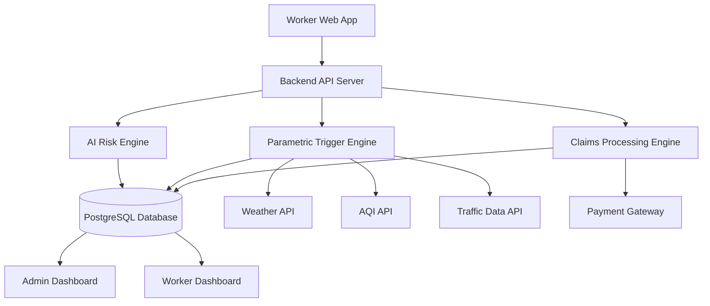

# GigaSure

### AI-Powered Parametric Insurance for Gig Delivery Workers

Protecting gig delivery workers from income loss caused by weather disruptions, pollution, and external events.

---

# DEVTrails 2026 Submission

Team: HackStreet Boys  
Project: GigaSure  
Phase: Phase 1 – Ideation & Foundation  

---

# Overview

GigaSure is an AI-powered parametric insurance platform designed to protect gig delivery workers from income loss caused by external disruptions such as heavy rain, heatwaves, pollution, and zone shutdowns.

Delivery partners in India often experience sudden income drops due to environmental conditions beyond their control. These disruptions can reduce their earnings by **20–30%**, and currently there is no insurance product that protects them from these short-term income losses.

GigaSure solves this problem by providing **automated income protection using AI risk modeling and parametric triggers**. When disruptions occur, the system detects them through external data sources and automatically initiates compensation for affected workers.

---

# Key Features

- AI-driven risk assessment
- Dynamic weekly premium calculation
- Automated disruption detection
- Parametric insurance triggers
- Instant payout simulation
- Fraud detection using anomaly detection
- Risk heatmap for delivery zones
- Smart coverage recommendation

---

# Target Persona

### Food Delivery Worker

Example Profile

| Attribute | Value |
|---|---|
Name | Ravi Kumar |
Age | 26 |
Platform | Swiggy |
City | Hyderabad |
Vehicle | Bike |
Daily Income | ₹900 |
Weekly Income | ₹6300 |

### Problem Scenario

Heavy rain occurs in Ravi’s delivery zone.

Deliveries slow down significantly and he loses several working hours.

| Metric | Value |
|---|---|
Normal Daily Income | ₹900 |
Hours Lost | 5 hours |
Income Loss | ₹450 |

GigaSure automatically compensates Ravi for the income he loses due to the disruption.

---

# Problem Statement

India’s gig delivery workforce plays a crucial role in the digital economy, yet workers remain financially vulnerable to disruptions such as weather events, pollution spikes, and city-wide restrictions.

Traditional insurance products do not cover **short-term income loss caused by environmental disruptions**.

GigaSure provides an **AI-driven parametric insurance platform that automatically detects disruptions and triggers payouts for lost income**.

---

# Disruptions Covered

The system monitors environmental and social disruptions that affect delivery operations.

| Disruption | Data Source | Impact |
|---|---|---|
Heavy Rain | Weather API | Delivery slowdown |
Heatwave | Temperature data | Reduced working hours |
Air Pollution | AQI API | Unsafe outdoor work |
Flooding | Weather alerts | Delivery suspension |
Curfew / Zone Closure | Government alerts / mock data | Restricted movement |

---

# Parametric Insurance Model

GigaSure uses **parametric triggers** to automate insurance claims.

### Example Trigger

```
Rainfall > 35 mm
AND
Delivery activity drop > 50%
```

If both conditions are satisfied:

- Claim is automatically initiated
- Income loss is calculated
- Worker receives payout

This removes the need for manual claim verification.

---

# Payout Calculation

Payout is based on estimated income loss.

Formula

```
Payout = (Hours Lost / Total Working Hours) × Daily Income
```

Example

```
Daily income = ₹900
Hours lost = 5
Total hours = 10

Payout = (5/10) × 900
Payout = ₹450
```

---

# Weekly Premium Model

The insurance policy uses a **weekly pricing structure aligned with gig workers’ earning cycles**.

Example Worker Earnings

Daily Income = ₹900  
Weekly Income = ₹6300  

Coverage Plan

```
Coverage = 40% of weekly income
Coverage = ₹2500
```

Weekly Premium

| Risk Level | Premium |
|---|---|
Low Risk Area | ₹25 |
Medium Risk Area | ₹40 |
High Risk Area | ₹60 |

Premiums are dynamically calculated using AI risk scoring.

---

# AI / Machine Learning Integration

GigaSure integrates AI in three key modules.

## Risk Prediction Model

Predicts risk level for each worker.

Inputs

- Location
- Historical rainfall data
- Temperature trends
- Flood probability
- AQI index
- Delivery demand patterns

Models

- Random Forest
- XGBoost

Outputs

- Risk score
- Recommended weekly premium

---

## Fraud Detection System

Detects suspicious claims.

Examples

- GPS spoofing
- Duplicate claims
- Fake disruption reports

Model

Isolation Forest anomaly detection.

---

## Disruption Prediction Engine

Predicts probability of upcoming disruptions.

Inputs

- Weather forecasts
- Historical weather patterns
- Traffic conditions

Outputs

- Predicted disruption probability
- Expected income loss

---

# Advanced Features

### Risk Heatmap

Visualizes high-risk delivery zones.

### Smart Coverage Recommendation

AI recommends optimal coverage for workers.

Example

```
Recommended weekly premium: ₹45
Recommended coverage: ₹3000
```

### Income Loss Forecast

Predicts potential income loss.

Example

```
Rain probability next week: 70%
Expected income loss: ₹1200
```

### Worker Safety Alerts

Workers receive disruption notifications.

Example

```
Heavy rain expected tomorrow.
Your insurance coverage is active.
```

### Transparent Claim Dashboard

Workers can see why claims were triggered.

| Metric | Value |
|---|---|
Rainfall | 48 mm |
Trigger Threshold | 35 mm |
Payout | ₹550 |

---

# Platform Choice

The system will be implemented as a **responsive web application**.

Reasons

- Accessible from all smartphones
- Faster development cycle
- No app store dependency
- Easy deployment and updates

---

# System Architecture

GigaSure follows a modular architecture where the frontend communicates with backend APIs responsible for AI risk modeling, disruption detection, and claims automation.

## Architecture Diagram



---

# Database Design

The backend uses **PostgreSQL** to manage system data.

Key tables

- Workers
- Policies
- Disruption Events
- Claims
- Payouts
- Fraud Logs
- Risk Predictions
- Notifications

Example Data Flow

```
Workers
   ↓
Policies
   ↓
Disruption Events
   ↓
Claims
   ↓
Payouts
```

---

# Technology Stack

Frontend

React + Vite  
CSS / Bootstrap

Backend

Node.js + Express

AI / Machine Learning

Python  
Scikit-learn

Database

PostgreSQL

External APIs

OpenWeather API  
AQI API  
Razorpay Sandbox

---

# Repository Structure

```
gigasur​e-insurance

frontend
 ├── worker-dashboard
 └── admin-dashboard

backend
 ├── auth
 ├── policies
 ├── claims
 └── triggers

ai-models
 ├── risk-model
 └── fraud-detection

docs
 └── architecture.md

README.md
```

---

# Development Plan

### Week 1

- Research delivery worker personas
- Define disruption triggers
- Design system architecture
- Setup project repository

### Week 2

- Define AI models
- Design UI wireframes
- Implement initial backend APIs
- Prepare prototype demonstration

---

# Expected Impact

GigaSure provides financial protection for gig workers who currently lack safety nets.

Benefits

- Protects gig workers from sudden income loss
- Enables automated insurance payouts
- Uses AI for fair dynamic pricing
- Creates a scalable insurance model for the gig economy

---

# Phase-1 Deliverables

The following items will be submitted:

- GitHub repository containing the idea document
- System architecture explanation
- AI integration plan
- Weekly premium model
- Application workflow
- 2-minute demo video explaining the concept
