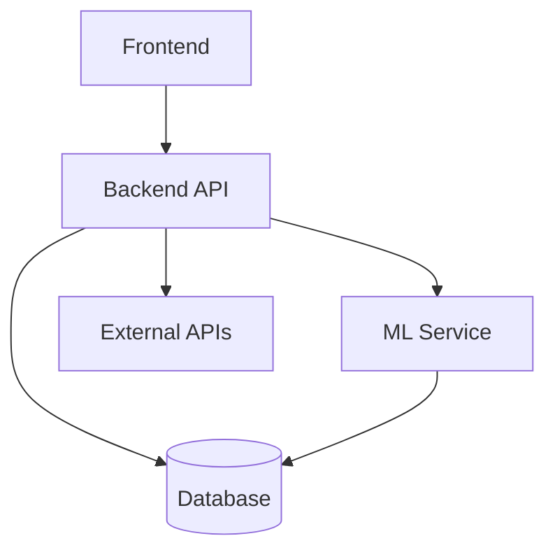

# 🚀 GigaSure  
### AI-Powered Parametric Insurance for Gig Delivery Workers  

Protecting gig delivery workers from income loss caused by weather disruptions, pollution, and external events.

---

# 🌍 DEVTrails 2026 Submission  

**Team:** HackStreet Boys  
**Project:** GigaSure  
**Phase:** Phase 3 – Soar 🚀  

---

# 🧠 Overview  

GigaSure is a **cloud-native, AI-powered parametric insurance platform** that protects gig delivery workers from income loss caused by real-world disruptions.

Gig workers often face **20–30% income drops** due to:
- Heavy rain 🌧️  
- Heatwaves ☀️  
- Air pollution 🌫️  
- Zone shutdowns 🚫  

❌ No existing insurance covers short-term income disruption  
✅ GigaSure solves this using AI + automated payouts  

---

# ⚡ Key Features  

- 🤖 AI-based risk prediction  
- 📊 Dynamic premium pricing  
- 🌦️ Real-time disruption detection  
- 💸 Automated claim triggering  
- 🛡️ Fraud detection (Isolation Forest)  
- 🗺️ Risk heatmaps  
- 🎯 Smart coverage recommendations  
- 📢 Worker alerts  

---

# 👤 Target Persona  

| Attribute | Value |
|---|---|
| Name | Ravi Kumar |
| Age | 26 |
| Platform | Swiggy |
| City | Hyderabad |
| Daily Income | ₹900 |
| Weekly Income | ₹6300 |

---

# ⚠️ Problem Scenario  

| Metric | Value |
|---|---|
| Normal Income | ₹900 |
| Hours Lost | 5 |
| Loss | ₹450 |

✅ GigaSure automatically compensates this loss  

---

# ⚙️ Parametric Insurance Model  

Trigger:

```
Rainfall > 35 mm AND Delivery drop > 50%
```

✔ Automatic claim  
✔ No manual verification  

---

# 💸 Payout Formula  

```
Payout = (Hours Lost / Total Hours) × Daily Income
```

Example:

```
(5 / 10) × 900 = ₹450
```

---

# 💰 Premium Model  

| Risk Level | Premium |
|---|---|
| Low | ₹25 |
| Medium | ₹40 |
| High | ₹60 |

✔ AI adjusts pricing dynamically  

---

# 🤖 AI Architecture  

### Risk Prediction  
- Models: Random Forest, XGBoost  
- Output: Risk score + premium  

### Fraud Detection  
- Model: Isolation Forest  

### Disruption Prediction  
- Forecasts weather + income loss  

---

# 🏗️ System Architecture  


---

# ☁️ Deployment Architecture  

| Layer | Platform |
|---|---|
| Frontend | Vercel |
| Backend | Render |
| ML Service | Render |
| Database | Neon PostgreSQL |
| CI/CD | GitHub Actions |

---

# 🧱 Tech Stack  

Frontend: React, Vite, Tailwind  
Backend: Spring Boot  
ML: Python, FastAPI, Scikit-learn  
Database: PostgreSQL (Neon)  
DevOps: Docker, GitHub Actions  

---

# 🔄 Data Flow  

1. User submits data  
2. Backend calls ML service  
3. Risk score generated  
4. Trigger conditions checked  
5. Claim auto-created  
6. Payout calculated  

---

# 🚧 Challenges  

- Multi-cloud deployment  
- Docker networking  
- Real-time ML inference  
- Secure environment configs  

---

# 🌍 Impact  

- Protects gig workers financially  
- Enables instant insurance payouts  
- Scalable across cities  

---

# 🔗 Live Demo  

https://gigasure.vercel.app/auth 

---

# 💻 GitHub  

https://github.com/CharanReddy2607/gigasure.git  

---

# 🎥 Demo Video  

https://youtube.com/your-demo-video  

---

# 🚀 Future Scope  

- Mobile app  
- Blockchain claims  
- Real payment integration  
- Advanced AI models  
